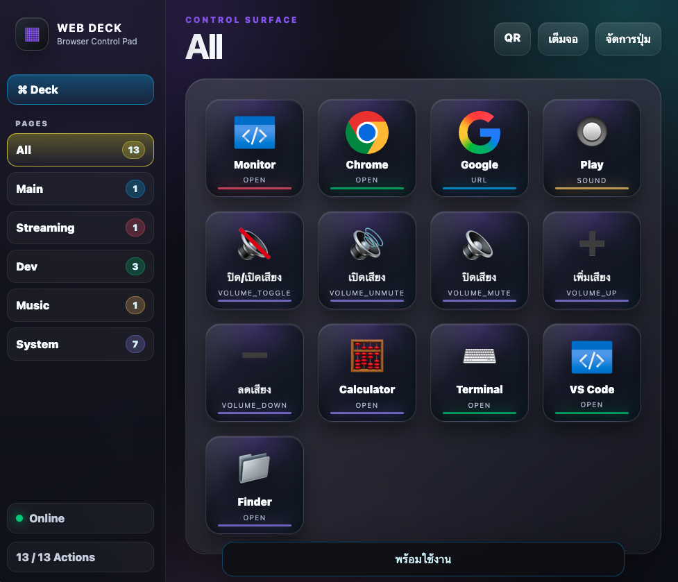

# Web Stream Deck

เว็บควบคุมเครื่องแบบ Stream Deck สำหรับเปิดแอป เปิดเว็บ รันคำสั่ง เล่นเสียง และควบคุมระดับเสียงผ่านเบราว์เซอร์ เหมาะสำหรับเปิดไว้บนมือถือ แท็บเล็ต หรือหน้าจอที่สอง แล้วกดสั่งงานเครื่องหลักในวง LAN เดียวกัน

โปรเจกต์นี้ใช้ Flask เป็น backend และเก็บรายการปุ่มไว้ใน `buttons.json`

## ฟีเจอร์หลัก

- หน้า Deck สำหรับกดปุ่มสั่งงานแบบ Stream Deck
- หน้า Settings สำหรับเพิ่ม แก้ไข ลบ และจัดลำดับปุ่ม
- แยกปุ่มเป็นหลายหน้า/หลายกลุ่ม เช่น `Streaming`, `Dev`, `Music`, `System`
- เลือกสี accent ต่อปุ่มและต่อหมวดได้
- ลากปุ่มในหน้า Settings เพื่อเปลี่ยนลำดับได้
- อัปโหลดไฟล์เสียงเข้าโฟลเดอร์ `sounds/` จากหน้าเว็บ
- อัปโหลดไอคอนรูปภาพเข้า `static/icons/` และใช้แทน emoji ได้
- Import / Export `buttons.json` จากหน้าเว็บ
- ปุ่มเต็มจอสำหรับใช้เป็น kiosk/control panel บนมือถือหรือแท็บเล็ต
- รองรับ token แบบง่ายผ่าน URL หรือ header
- รองรับ macOS, Windows และ Linux สำหรับคำสั่งเปิดแอป/ไฟล์และควบคุมเสียง

## โครงสร้างไฟล์

```text
.
├── .env.example           # ตัวอย่างค่า environment variables
├── .github/workflows/     # GitHub Actions smoke test
├── .gitignore             # รายการไฟล์ local ที่ไม่ควร commit
├── app.py                 # Flask server และ API ทั้งหมด
├── buttons.json           # รายการปุ่มและ action
├── page_colors.json       # สีประจำหมวด
├── requirements.txt       # Python dependencies
├── sounds/                # ไฟล์เสียงที่ใช้กับปุ่ม type=sound
├── static/
│   ├── icons/             # ไอคอนปุ่มที่อัปโหลด
│   └── style.css          # หน้าตา Stream Deck และหน้าจัดการปุ่ม
└── templates/
    ├── index.html         # หน้า Deck
    ├── qr.html            # หน้า QR Code สำหรับมือถือ
    └── settings.html      # หน้า Settings
```

## ติดตั้ง

ต้องมี Python 3 ก่อน แนะนำให้สร้าง virtual environment แล้วติดตั้ง dependency จาก `requirements.txt`:

```bash
python3 -m venv .venv
source .venv/bin/activate
python3 -m pip install -r requirements.txt
```

บน Windows:

```powershell
py -m venv .venv
.\.venv\Scripts\Activate.ps1
py -m pip install -r requirements.txt
```

## รันโปรแกรม

```bash
python3 app.py
```

ค่าเริ่มต้นของโปรแกรม:

- Host: `0.0.0.0`
- Port: `5001`
- Token: `1234`

เมื่อรันแล้ว terminal จะแสดง URL สำหรับเปิดในเครื่องเดียวกันและ URL สำหรับเปิดจากมือถือ/แท็บเล็ตในวง LAN

## เปิดใช้งาน

หน้า Deck:

```text
http://127.0.0.1:5001/?token=1234
```

เปิด Deck แสดงทุกปุ่ม:

```text
http://127.0.0.1:5001/?token=1234&page=All
```

เปิด Deck เฉพาะกลุ่ม:

```text
http://127.0.0.1:5001/?token=1234&page=Dev
```

หน้า Settings:

```text
http://127.0.0.1:5001/settings?token=1234
```

เปิด Settings เฉพาะกลุ่ม:

```text
http://127.0.0.1:5001/settings?token=1234&page=Music
```

ถ้าจะเปิดจากเครื่องอื่นใน Wi-Fi เดียวกัน ให้ใช้ IP เครื่องที่รัน server เช่น:

```text
http://192.168.1.25:5001/?token=1234
```

## ตั้งค่าผ่าน Environment Variables

สามารถเปลี่ยน host, port และ token ได้โดยตั้ง environment variables ก่อนรัน:

```bash
WEB_DECK_HOST=0.0.0.0 WEB_DECK_PORT=5001 WEB_DECK_TOKEN=mytoken python3 app.py
```

จากนั้นเปิดเว็บด้วย token ใหม่:

```text
http://127.0.0.1:5001/?token=mytoken
```

ดูตัวอย่างค่าเริ่มต้นได้จาก `.env.example`

## ประเภทปุ่มที่รองรับ

ทุกปุ่มสามารถใส่ field `page` เพื่อแยกกลุ่มได้ ถ้าไม่ใส่ ระบบจะถือว่าอยู่หน้า `Main`

field `icon` รองรับทั้ง emoji และ path รูปภาพ เช่น `/static/icons/chrome.png`

field `color` รองรับสี accent ของปุ่มในรูปแบบ `#RRGGBB`

ตัวอย่างชื่อกลุ่มที่มีให้เลือกตั้งต้น หน้า Deck จะมี `All` สำหรับแสดงทุกปุ่ม:

```text
All
Main
Streaming
Dev
Music
System
```

### `open`

เปิดแอป ไฟล์ หรือโฟลเดอร์

ตัวอย่าง target แบบข้ามระบบ:

```text
app:Chrome
app:Calculator
app:Terminal
app:VSCode
app:Explorer
app:Notepad
```

ระบบจะเลือกคำสั่งตาม OS อัตโนมัติ เช่น `app:Calculator` จะเปิด Calculator บน macOS และ `calc` บน Windows

ตัวอย่าง path ตรง:

```text
/Applications/Google Chrome.app
C:\Program Files\Google\Chrome\Application\chrome.exe
```

บน Windows สามารถใส่ path, ชื่อโปรแกรม, หรือ alias ผ่าน `app:` ได้ ส่วน Linux ใช้ `xdg-open` หรือ alias ที่แมปไว้

### `url`

เปิดเว็บไซต์ใน browser หลักของเครื่อง

```text
https://google.com
https://chatgpt.com
```

### `command`

รันคำสั่งผ่าน shell

```text
python3 /Users/yourname/project/yolo/main.py
python C:\project\main.py
start chrome
notepad
open -a "Google Chrome"
```

หมายเหตุ: ปุ่มประเภทนี้ใช้ `shell=True` จึงควรใช้เฉพาะกับคำสั่งที่คุณเชื่อถือเท่านั้น และไม่ควรเปิด token ให้คนอื่นในเครือข่ายใช้งาน

### `sound`

เล่นไฟล์เสียงจาก `sounds/` หรือ path เต็มในเครื่อง

```text
alert.wav
/Users/yourname/Music/alert.mp3
```

นามสกุลที่รองรับ:

```text
.mp3, .wav, .m4a, .aac, .ogg, .flac
```

การเล่นเสียงแยกตามระบบ:

- macOS: ใช้ `afplay`
- Windows: ใช้ PowerShell / MediaPlayer
- Linux: ใช้ `paplay`, `aplay` หรือ `ffplay`

### ปุ่มควบคุมเสียง

ปุ่มเหล่านี้ไม่ต้องใส่ target:

```text
volume_toggle
volume_mute
volume_unmute
volume_up
volume_down
```

สำหรับ `volume_up` และ `volume_down` สามารถตั้ง `step` ได้ตั้งแต่ `1` ถึง `20`

บน Windows ระบบใช้ PowerShell เรียก Windows audio endpoint ทำให้ `volume_mute`, `volume_unmute`, `volume_toggle`, `volume_up`, และ `volume_down` แยกทำงานตรงตามชื่อ ไม่ใช่แค่กดปุ่ม mute สลับสถานะ

## การใช้งานบน Windows / macOS / Linux

โปรแกรมเลือกคำสั่งตามระบบปฏิบัติการอัตโนมัติ:

- macOS: `app:*` จะเปิดผ่าน `open -a`, volume ใช้ `osascript`, sound ใช้ `afplay`
- Windows: `app:*` จะ map เป็นคำสั่ง Windows เช่น `chrome`, `calc`, `explorer`, `wt`, `code`; volume ใช้ PowerShell Audio API; sound ใช้ PowerShell
- Linux: เปิดไฟล์/URL ผ่าน `xdg-open`, volume ใช้ `pactl`, sound ใช้ `paplay/aplay/ffplay`

Alias ที่รองรับใน `app:`:

```text
app:Chrome
app:Google Chrome
app:Calculator
app:Terminal
app:PowerShell
app:CMD
app:VSCode
app:Explorer
app:Finder
app:Notepad
```

## ตัวอย่าง `buttons.json`

```json
[
  {
    "id": "chrome",
    "title": "Chrome",
    "icon": "/static/icons/chrome.png",
    "page": "Dev",
    "color": "#33d17a",
    "type": "open",
    "target": "app:Google Chrome"
  },
  {
    "id": "google",
    "title": "Google",
    "icon": "🔎",
    "page": "Main",
    "type": "url",
    "target": "https://google.com"
  },
  {
    "id": "play_alert",
    "title": "เล่นเสียง Alert",
    "icon": "🔔",
    "page": "Music",
    "type": "sound",
    "target": "alert.wav"
  },
  {
    "id": "volume_up",
    "title": "เพิ่มเสียง",
    "icon": "➕",
    "page": "System",
    "type": "volume_up",
    "step": 4
  }
]
```

แนะนำให้แก้ปุ่มผ่านหน้า Settings เป็นหลัก เพราะระบบจะสร้าง `id` และ validate ค่าให้เอง

## ไอคอนปุ่ม

ในหน้าจัดการปุ่มสามารถใช้ emoji แบบเดิม หรืออัปโหลดไฟล์ไอคอนรูปภาพได้ รองรับ:

```text
.png, .jpg, .jpeg, .gif, .webp, .svg
```

เมื่ออัปโหลดแล้วระบบจะใส่ path เช่น `/static/icons/my_icon.png` ลงในช่องไอคอนให้ทันที

## การจัดกลุ่ม / หลายหน้า Deck

หน้า Deck จะแสดงปุ่มเฉพาะกลุ่มที่เลือกจาก sidebar เท่านั้น ทำให้แยกงานเป็นหน้า ๆ ได้ เช่น:

- `Streaming`: ปุ่มเปิด OBS, เล่น sound effect, เปิด dashboard
- `Dev`: ปุ่มเปิด VS Code, Terminal, Chrome, รัน script
- `Music`: ปุ่มเล่นเสียงหรือเปิดแอปเพลง
- `System`: ปุ่มเพิ่ม/ลดเสียง, mute, Finder, Calculator

ในหน้า Settings จะมีช่อง `กลุ่ม / หน้า Deck` ตอนเพิ่มหรือแก้ไขปุ่ม สามารถเลือกกลุ่มเดิมจากรายการ หรือพิมพ์ชื่อกลุ่มใหม่ได้เลย ระบบจะนำกลุ่มใหม่นั้นไปแสดงใน sidebar อัตโนมัติ

## สีปุ่มและสีหมวด

หน้าจัดการปุ่มมีช่องเลือกสี 2 แบบ:

- `สีหมวด`: ใช้เป็นสีหลักของ tab หมวด และเป็นสี fallback ของปุ่มในหมวดนั้น
- `สีปุ่ม`: ใช้ override สีของปุ่มนั้นโดยเฉพาะ

ถ้าปุ่มไม่ได้ตั้ง `color` เอง ระบบจะใช้สีหมวดของปุ่มนั้นแทน

## Theme Presets

หน้า `จัดการปุ่ม` มีส่วน `ธีมหน้าตา` สำหรับเลือก preset สำเร็จรูป:

- `Neon Dark`
- `Studio`
- `Minimal`
- `iOS Glass`

ระบบจะบันทึกธีมปัจจุบันไว้ และนำธีมเดียวกันไปใช้กับหน้า Deck, Settings และ QR อัตโนมัติ

## Import / Export Config

ในหน้าจัดการปุ่มมีปุ่ม:

- `Export`: ดาวน์โหลด `buttons.json`
- `Import`: อัปโหลดไฟล์ JSON เพื่อแทน config ปุ่มปัจจุบัน

ก่อน import ระบบจะถามยืนยัน เพราะไฟล์ใหม่จะแทนรายการปุ่มเดิม

## Auto Backup

ทุกครั้งที่มีการแก้ปุ่ม, ลบปุ่ม, จัดลำดับ, import config หรือเปลี่ยนสีหมวด ระบบจะสำรอง config เดิมไว้ที่:

```text
backups/
```

ไฟล์ backup จะเก็บทั้ง `buttons` และ `page_colors` ในไฟล์ JSON เดียว และระบบจะเก็บ backup ล่าสุดไว้ประมาณ 30 ไฟล์ เพื่อใช้ย้อนกลับได้ถ้าตั้งค่าพลาด

## Multi-action / Macro

ปุ่มประเภท `macro` ใช้รวมหลาย action ไว้ในปุ่มเดียว เช่น เปิด VS Code รอ 1 วินาที แล้วเปิดเว็บ:

```json
{
  "id": "start_dev",
  "title": "Start Dev",
  "icon": "🚀",
  "page": "Dev",
  "type": "macro",
  "actions": [
    {"type": "open", "target": "app:VSCode"},
    {"type": "delay", "delay": 1},
    {"type": "url", "target": "https://chatgpt.com"}
  ]
}
```

ชนิด action ที่ใช้ใน macro ได้:

- `open`
- `url`
- `command`
- `sound`
- `volume_toggle`
- `volume_mute`
- `volume_unmute`
- `volume_up`
- `volume_down`
- `delay`

สำหรับ `volume_up` และ `volume_down` ใส่ `step` ได้ เช่น `{"type":"volume_up","step":4}` ส่วน `delay` ใส่หน่วยเป็นวินาที

## Fullscreen / Kiosk Mode

หน้า Deck มีปุ่ม `เต็มจอ` สำหรับเข้าโหมด fullscreen บนอุปกรณ์ที่รองรับ เหมาะกับมือถือ/แท็บเล็ตที่ใช้เป็นแผงควบคุมตลอดเวลา

## QR Code สำหรับมือถือ

เปิดหน้า:

```text
http://127.0.0.1:5001/qr?token=1234
```

แล้วสแกน QR จากมือถือหรือแท็บเล็ตที่อยู่ Wi-Fi เดียวกัน ระบบจะสร้าง QR จาก LAN IP ของเครื่องที่รัน server เพื่อเข้า Deck ได้เร็วขึ้น

## API

ทุก endpoint ต้องส่ง token ผ่าน query string หรือ header `X-Web-Deck-Token`

ตัวอย่าง:

```bash
curl -X POST "http://127.0.0.1:5001/api/run/chrome?token=1234"
```

รายการ API หลัก:

```text
GET    /api/buttons
POST   /api/buttons
PUT    /api/buttons/<button_id>
DELETE /api/buttons/<button_id>
POST   /api/buttons/<button_id>/move
POST   /api/buttons/reorder
GET    /api/config/export
POST   /api/config/import
GET    /api/page-colors
POST   /api/page-colors
GET    /api/sounds
POST   /api/sounds
GET    /api/icons
POST   /api/icons
POST   /api/run/<button_id>
```

## การใช้งานจากมือถือหรือแท็บเล็ต

1. รัน `python3 app.py` บนเครื่องหลัก
2. ดู URL ที่ terminal แสดงในบรรทัด `Open on phone/tablet`
3. เปิด URL นั้นบนมือถือหรือแท็บเล็ตที่อยู่ Wi-Fi เดียวกัน
4. กดปุ่มจากหน้า Deck เพื่อสั่งงานเครื่องหลัก

ถ้าเปิดจากอุปกรณ์อื่นไม่ได้ ให้เช็ก firewall, Wi-Fi network และตรวจว่า port ที่ใช้คือ `5001` หรือ port ที่ตั้งไว้ใน `WEB_DECK_PORT`

## ข้อควรระวัง

- Token ค่าเริ่มต้นคือ `1234` ควรเปลี่ยนก่อนใช้งานจริงในเครือข่ายที่มีคนอื่น
- ปุ่ม `command` สามารถรันคำสั่งบนเครื่องได้ ควรใช้กับเครือข่ายที่ไว้ใจได้เท่านั้น
- ไฟล์ `buttons.json` คือ config หลัก ควรสำรองไว้ถ้าปรับแต่งเยอะ
- ถ้าใช้ Linux และเล่นเสียงไม่ได้ ให้ติดตั้ง player อย่าง `paplay`, `aplay` หรือ `ffplay`

## ทดสอบเร็ว

เช็กว่า Python อ่านไฟล์หลักได้:

```bash
python3 -m py_compile app.py
```

รัน server:

```bash
python3 app.py
```
